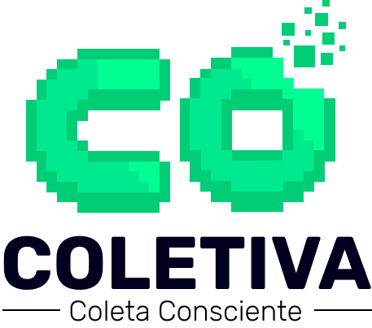

# CO | GAME DE COLETA SELETIVA

O CO é um jogo e uma maneira de promover a gestão responsável de resíduos, enquanto fornece uma experiência de jogo divertida.

<h4 align="center">    
 :construction:  Projeto em construção  :construction:
</h4>

 

# 1. Instruções de como contribuir com o projeto!

Entrar no [Canal de Discurções](https://github.com/Ias4g/game-godot-project-interactive-systems/discussions/7) e ler as instruções contidas lá, você também pode comentar, deixar sugestões e muito mais.

# 2. ✔️ Técnicas e tecnologias ultilizadas
* `GDScript`
* `Godot Engine`
* `Paradigma de programação orientado a objetos`

# 3. Colaboradores
| [ Alan Christian](https://github.com/AlannChris) | [ Deise Santos](https://github.com/Deyzy) | [ Eversson Santana](https://github.com/EverssonBela) | [ Izael Silva](https://github.com/ias4g) | [ Paulo Roberto Filho](https://github.com/PauloRobertoFilhoo) | [ Izael student](https://github.com/studentias) |
| :---: | :---: | :---: | :---: | :---: | :---: |

Gabriel 
